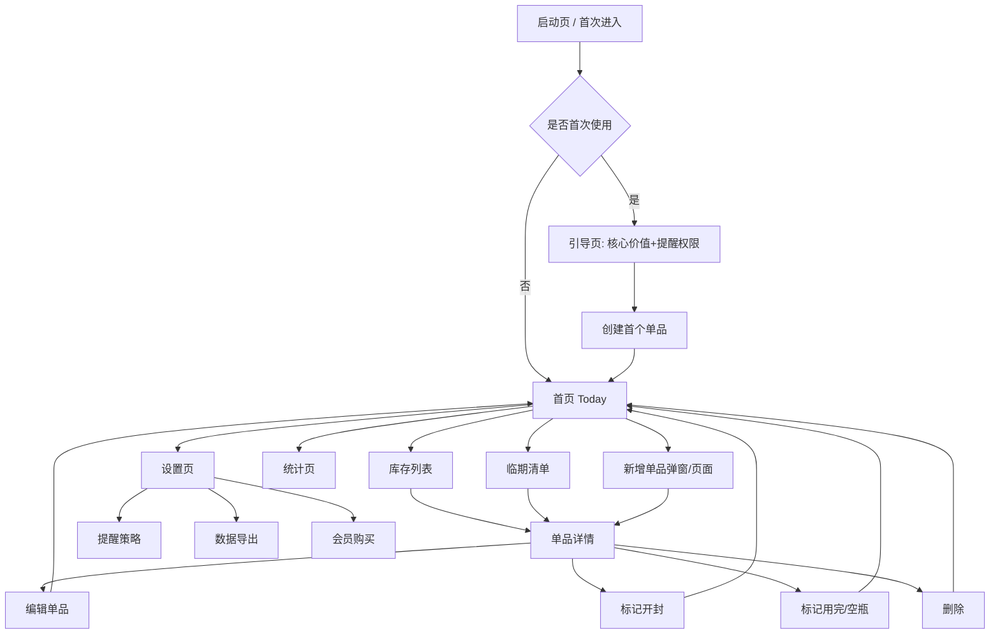

# 前端交互图（美妆囤货 / 开封保质期管理）

> 按你的要求先给出前端交互图，便于后续再细化 UI 与开发。

## 1) 全局页面流转图



---

## 2) 首页（Today）交互图

```mermaid
flowchart LR
    A[首页顶部: 今日日期+搜索] --> B[提醒卡片区]
    B --> B1[已过期 P0]
    B --> B2[7天内到期 P1]
    B --> B3[30天内到期 P2]

    A --> C[优先使用清单]
    C --> C1[卡片: 产品名/剩余量/到期日/建议动作]
    C1 --> D[点击卡片进入单品详情]

    A --> E[快捷操作区]
    E --> E1[+ 新增单品]
    E --> E2[扫码录入(高级)]
    E --> E3[一键标记开封]

    E1 --> F[新增单品表单]
    E3 --> G[选择库存并确认开封日期]
```

---

## 3) 单品详情页交互图

```mermaid
flowchart TD
    A[单品详情] --> B[基础信息区: 品牌/品名/规格]
    A --> C[双效期时间轴]
    C --> C1[未开封截止日]
    C --> C2[开封日 + PAO]
    C --> C3[实际到期日=min(C1, C2)]

    A --> D[库存与消耗]
    D --> D1[剩余量滑杆/输入]
    D --> D2[预计可用天数]

    A --> E[操作按钮]
    E --> E1[编辑]
    E --> E2[标记开封]
    E --> E3[标记用完]
    E --> E4[删除]

    E2 --> F[开封日期选择器]
    F --> G[重算提醒计划]
    G --> H[返回详情并toast提示]

    E3 --> I[空瓶记录弹窗]
    I --> J[写评语/是否回购]
    J --> K[进入空瓶墙]
```

---

## 4) 新增单品表单字段（前端）

```mermaid
flowchart TD
    A[新增单品] --> B[基础字段]
    B --> B1[品牌]
    B --> B2[品名]
    B --> B3[品类]
    B --> B4[规格]

    A --> C[效期字段]
    C --> C1[未开封截止日]
    C --> C2[PAO(月)]
    C --> C3[是否已开封]
    C3 -->|是| C4[开封日期]

    A --> D[库存字段]
    D --> D1[数量]
    D --> D2[价格(可选)]

    A --> E[提醒字段]
    E --> E1[未开封提前提醒: 60/30/7]
    E --> E2[开封后提前提醒: 30/14/3]

    A --> F[保存]
    F --> G{是否缺关键字段}
    G -- 是 --> H[错误提示+滚动定位]
    G -- 否 --> I[写入本地数据库+回首页]
```

---

## 5) 底部导航建议

- Today（默认首页）
- 库存
- 统计
- 我的

---

## 6) 交互优先级（先做）

1. 新增单品 → 保存成功 → 首页可见
2. 标记开封 → 自动计算实际到期日 → 更新提醒
3. 临期列表点击 → 进入详情 → 快速处理（用完/丢弃/延期提醒）

